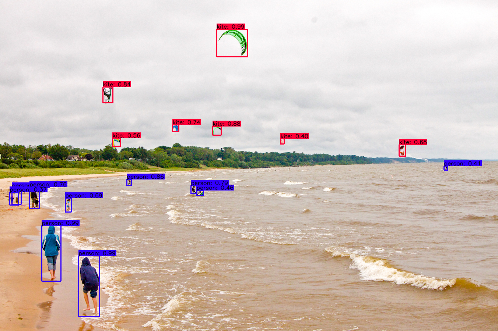

# tensorflow-yolov4-tflite
[](LICENSE)

YOLOv4, YOLOv4-tiny Implemented in Tensorflow 2.0. 
Convert YOLO v4, YOLOv3, YOLO tiny .weights to .pb, .tflite and trt format for tensorflow, tensorflow lite, tensorRT.
<p align="center"></p>

## Getting Started
### Windows Terminal using Pip

```bash
# TensorFlow CPU
pip install -r requirements.txt

# TensorFlow GPU
pip install -r requirements-gpu.txt
```
### Nvidia Driver (For GPU, if you are using windows terminal)
Make sure to use CUDA Toolkit version 10.1 and cudnn 7.5 as these are the proper version for the TensorFlow version used in this repository.
https://developer.nvidia.com/cuda-10.1-download-archive-update2


## Downloading Official Pre-trained Weights
YOLOv4 comes pre-trained and able to detect 80 classes. For easy demo purposes we will use the pre-trained weights.
Download pre-trained yolov4.weights file: https://drive.google.com/open?id=1cewMfusmPjYWbrnuJRuKhPMwRe_b9PaT

Copy and paste yolov4.weights from your downloads folder into the 'data' folder of this repository.

If you want to use yolov4-tiny.weights, a smaller model that is faster at running detections but less accurate, download file here: https://github.com/AlexeyAB/darknet/releases/download/darknet_yolo_v4_pre/yolov4-tiny.weights


## YOLOv4 Using Tensorflow (tf, .pb model)
To implement YOLOv4 using TensorFlow, first we convert the .weights into the corresponding TensorFlow model files and then run the model.
```bash
# Convert darknet weights to tensorflow
## yolov4
python save_model.py --weights ./data/yolov4.weights --output ./checkpoints/yolov4-416 --input_size 416 --model yolov4 


# Run yolov4 tensorflow model
python detect.py --weights ./checkpoints/yolov4-416 --size 416 --model yolov4 --images ./data/images/kite.jpg


# Run yolov4 on video
python detect_video.py --weights ./checkpoints/yolov4-416 --size 416 --model yolov4 --video ./data/video/video.mp4 --output ./detections/results.avi


# Run yolov4 on webcam
python detect_video.py --weights ./checkpoints/yolov4-416 --size 416 --model yolov4 --video 0 --output ./detections/results.avi
```


### Result Image(s) (Regular TensorFlow)
You can find the outputted image(s) showing the detections saved within the 'detections' folder.
#### Pre-trained YOLOv4 Model Example
<p align="center"></p>


### Result Video
Video saves wherever you point --output flag to. If you don't set the flag then your video will not be saved with detections on it.
<p align="center"></p>

## YOLOv4 Using TensorFlow Lite (.tflite model)
Can also implement YOLOv4 using TensorFlow Lite. TensorFlow Lite is a much smaller model and perfect for mobile or edge devices (raspberry pi, etc).
```bash
# Save tf model for tflite converting
python save_model.py --weights ./data/yolov4.weights --output ./checkpoints/yolov4-416 --input_size 416 --model yolov4 --framework tflite

# yolov4
python convert_tflite.py --weights ./checkpoints/yolov4-416 --output ./checkpoints/yolov4-416.tflite

# yolov4 quantize float16
python convert_tflite.py --weights ./checkpoints/yolov4-416 --output ./checkpoints/yolov4-416-fp16.tflite --quantize_mode float16

# Run tflite model
python detect.py --weights ./checkpoints/yolov4-416.tflite --size 416 --model yolov4 --images ./data/images/kite.jpg --framework tflite


```
### Result Image (TensorFlow Lite)
You can find the outputted image(s) showing the detections saved within the 'detections' folder.


```

## Command Line Args Reference

```bash
save_model.py:
  --weights: path to weights file
    (default: './data/yolov4.weights')
  --output: path to output
    (default: './checkpoints/yolov4-416')
  --[no]tiny: yolov4 or yolov4-tiny
    (default: 'False')
  --input_size: define input size of export model
    (default: 416)
  --framework: what framework to use (tf, trt, tflite)
    (default: tf)
  --model: yolov3 or yolov4
    (default: yolov4)

detect.py:
  --images: path to input images as a string with images separated by ","
    (default: './data/images/kite.jpg')
  --output: path to output folder
    (default: './detections/')
  --[no]tiny: yolov4 or yolov4-tiny
    (default: 'False')
  --weights: path to weights file
    (default: './checkpoints/yolov4-416')
  --framework: what framework to use (tf, trt, tflite)
    (default: tf)
  --model: yolov3 or yolov4
    (default: yolov4)
  --size: resize images to
    (default: 416)
  --iou: iou threshold
    (default: 0.45)
  --score: confidence threshold
    (default: 0.25)
    
detect_video.py:
  --video: path to input video (use 0 for webcam)
    (default: './data/video/video.mp4')
  --output: path to output video (remember to set right codec for given format. e.g. XVID for .avi)
    (default: None)
  --output_format: codec used in VideoWriter when saving video to file
    (default: 'XVID)
  --[no]tiny: yolov4 or yolov4-tiny
    (default: 'false')
  --weights: path to weights file
    (default: './checkpoints/yolov4-416')
  --framework: what framework to use (tf, trt, tflite)
    (default: tf)
  --model: yolov3 or yolov4
    (default: yolov4)
  --size: resize images to
    (default: 416)
  --iou: iou threshold
    (default: 0.45)
  --score: confidence threshold
    (default: 0.25)
```

## Evaluate on COCO 2017 Dataset
```bash
# run script in /script/get_coco_dataset_2017.sh to download COCO 2017 Dataset
# preprocess coco dataset
cd data
mkdir dataset
cd ..
cd scripts
python coco_convert.py --input ./coco/annotations/instances_val2017.json --output val2017.pkl
python coco_annotation.py --coco_path ./coco 
cd ..

# evaluate yolov4 model
python evaluate.py --weights ./data/yolov4.weights
cd mAP/extra
python remove_space.py
cd ..
python main.py --output results_yolov4_tf
```
#### mAP50 on COCO 2017 Dataset

| Detection   | 512x512 | 416x416 | 320x320 |
|-------------|---------|---------|---------|
| YoloV3      | 55.43   | 52.32   |         |
| YoloV4      | 61.96   | 57.33   |         |

## Benchmark
```bash
python benchmarks.py --size 416 --model yolov4 --weights ./data/yolov4.weights
```


#### Nvidia 1660 Ti (intel CORE i7 9th Gen)

| Detection   |  416x416 |
|-------------|----------|  
| YoloV4 FPS  |    22    |


## Traning your own model in TensorFlow
```bash
# Prepare your dataset
# If you want to train from scratch:
In config.py set FISRT_STAGE_EPOCHS=0 
# Run script:
python train.py

# Transfer learning: 
python train.py --weights ./data/yolov4.weights
```
The training performance is not fully reproduced yet, so I recommended to use Alex's [Darknet](https://github.com/AlexeyAB/darknet) to train your own data, then convert the .weights to tensorflow or tflite.

<strong>Use this video to train your own model easily in Google Colab: https://www.youtube.com/watch?v=mmj3nxGT2YQ </strong>


### References

  * YOLOv4: Optimal Speed and Accuracy of Object Detection [YOLOv4](https://arxiv.org/abs/2004.10934).
  * [darknet](https://github.com/AlexeyAB/darknet)
  
   My project is inspired by these previous fantastic YOLOv3 implementations:
  * [Yolov3 tensorflow](https://github.com/YunYang1994/tensorflow-yolov3)
  * [Yolov3 tf2](https://github.com/zzh8829/yolov3-tf2)

